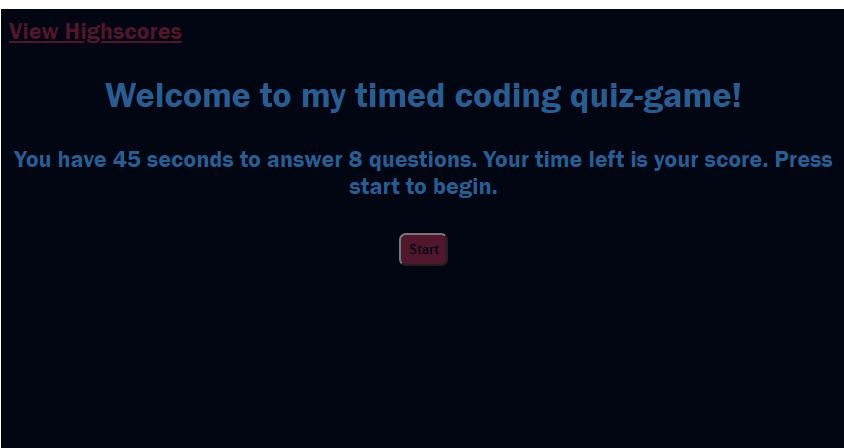

# Code-Quiz
A timed quiz on JavaScript fundamentals that stores high scores

The questions are not the best but all the acceptance criteria has been met. I only applied basic styling focusing more on the functionality.

[https://github.com/Billygm/Code-Quiz](https://github.com/Billygm/Code-Quiz)

[https://billygm.github.io/Code-Quiz/](https://billygm.github.io/Code-Quiz/)